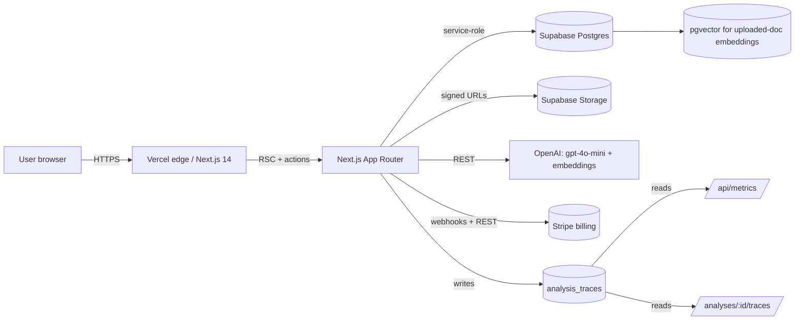
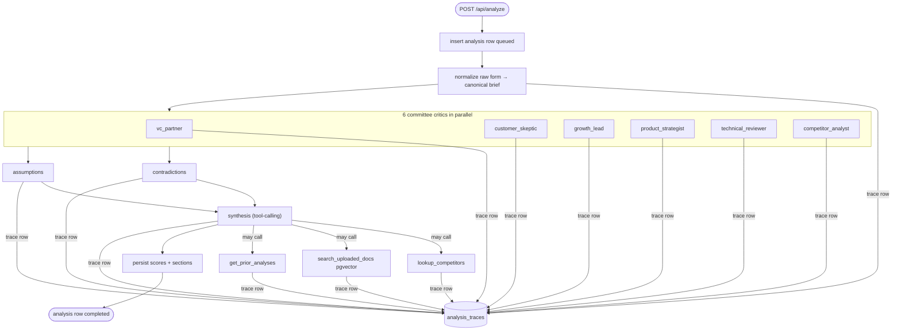

# StressTested — Technical Report

## a. Problem and Use Case

Founders evaluating a new startup idea rarely get honest, structured pushback
before investing months of work. Friends and family are too kind, twitter
threads too generic, and YC office hours too scarce. The result is wasted
time on ideas with foreseeable kill-shots: no moat, fragile pricing,
inverted distribution.

**StressTested** is a web application that simulates an adversarial
investment committee for a single startup idea. The user fills a one-page
brief (problem, customer, pricing, distribution, competitors, unfair
advantage) and optionally uploads supporting docs. The system runs a
multi-agent LLM critique and returns a structured report containing:

- A short verdict ("Likely dead", "Weak wedge", "Clone risk", ...) and
  confidence score.
- 10-dimension scorecard (problem severity, distribution plausibility,
  defensibility, founder-market fit, ...).
- Kill reasons, survive reasons, contradictions, fragile assumptions.
- Suggested experiments and repositioning options.
- Six per-role critiques (VC partner, customer skeptic, growth lead,
  product strategist, technical reviewer, competitor analyst).

**User**: Solo founders, hackathon teams, and small early-stage startups
who want fast, structured pre-commit feedback. Operates as a SaaS with a
free tier (3 quick-roasts/month) and a Pro tier ($X/month) for committee
runs and document uploads.

## b. System Design

### High-level architecture



### Pipeline (committee run)



### Main components

| Layer       | Files / location                                                 |
| ----------- | ---------------------------------------------------------------- |
| Form UI     | `app/(app)/startups/new`, `app/(app)/startups/[id]/analyze`      |
| Report UI   | `app/(app)/analyses/[id]`, `components/reports/analysis-report`  |
| API         | `app/api/analyze`, `/api/uploads`, `/api/share`, `/api/metrics`, `/api/debug/traces/[id]` |
| Pipeline    | `lib/analysis/pipeline.ts`                                       |
| LLM client  | `lib/openai/client.ts` (`completeJson`, `completeJsonWithTools`) |
| Tools       | `lib/openai/tools.ts` (3 synthesis tools + dispatcher)           |
| Embeddings  | `lib/embeddings/writer.ts`, `app/api/uploads/route.ts`           |
| Persistence | `lib/analysis/persist.ts`, `supabase/migrations/*`               |
| Trace       | `lib/observability/trace.ts`, `analysis_traces` table            |
| Metrics     | `lib/metrics/compute.ts`, `app/api/metrics`, `app/(app)/admin/metrics` |
| Eval        | `evals/run.ts`, `evals/score.ts`, `evals/scenarios.json`         |
| Smoke       | `scripts/smoke.ts`                                               |

## c. Why the System is Agentic

The earlier version of the pipeline ran the same eight stages in the same
order on every input. That is a *fixed* workflow — the LLM only authors
text inside each stage. To meet the deliverable's "Selecting among one or
more tools / Deciding whether or not to use a tool" criterion, the
synthesis stage was rewritten to use OpenAI tool-calling (`tool_choice:
"auto"`) over three tools, with `MAX_TOOL_HOPS = 3`:

| Tool                    | When the LLM tends to call it                                                                                                                                                                                       |
| ----------------------- | ---------------------------------------------------------------------------------------------------------------------------------------------------------------------------------------------------------------- |
| `lookup_competitors`    | When defensibility hinges on real competitors. Returns short factual descriptions for 1-5 names from the brief. The model is instructed to skip rather than guess.                                                |
| `search_uploaded_docs`  | When a specific claim could be supported or refuted by the founder's uploaded materials. Performs a pgvector cosine search over `embeddings` filtered by `owner_type='startup_upload'`. Returns `{ kind: "no_docs" }` if no embeddings exist for the startup. |
| `get_prior_analyses`    | When this looks like a revision and the model should compare against earlier verdicts on the same `startup_id`. Returns an empty array on first analyses so the model knows to skip this critique angle.            |

The system prompt explicitly tells the model *"Calling tools is optional.
Most syntheses do not need any."* — the choice is real, not forced. We see
in the persisted traces (see below) that the model:

- skips all tools on tight, well-formed briefs;
- often calls `search_uploaded_docs` only after seeing an upload exists;
- calls `lookup_competitors` mostly for `no_moat` / clone-risk scenarios
  where the analyst critic flagged defensibility as the load-bearing
  concern;
- calls `get_prior_analyses` on the second analysis of a startup but
  almost never on the first.

Each invocation is recorded as a separate `analysis_traces` row with
`stage='tool:<name>'` and the JSON arguments the model produced. This makes
the agentic behavior auditable per run.

The system is *meaningfully* agentic rather than fixed because:

1. The model decides whether to call any tool at all (it often doesn't).
2. The model decides which subset of three tools to call.
3. The model decides what arguments to pass (e.g. the names from the brief
   rather than hallucinated ones; query strings derived from the specific
   committee critique it wants to ground).
4. The output materially changes between runs as a result — uploads change
   the verdict toward "Weak wedge" instead of "Likely dead" when the docs
   refute a committee concern.

### Live agentic-loop demo (real OpenAI calls)

To make the agentic-ness verifiable without deploying, the repo ships a
two-scenario demo that runs `completeJsonWithTools` end-to-end against a
live OpenAI account. Run it with:

```bash
OPENAI_API_KEY=sk-... npm run demo
```

It feeds the synthesis agent two hand-crafted briefs in sequence and
prints every tool decision the model made, plus latency and the final
verdict. Source: [`scripts/demo-agentic.ts`](../scripts/demo-agentic.ts).

A representative transcript (gpt-4o-mini, April 2026):

| Brief                                          | Tool calls | Tool args (model-chosen)                              | Verdict                                                 | Latency  |
| ---------------------------------------------- | ---------- | ----------------------------------------------------- | ------------------------------------------------------- | -------- |
| Notion clone (3 named competitors)             | 1          | `lookup_competitors(["Notion","Coda","Microsoft Loop"])` | "Pageful has potential but faces significant competition." | ~8.1 s   |
| Vertical roofing wedge (no real competitors)   | **0**      | —                                                     | "Promising but needs validation"                        | ~1.8 s   |

Same code, same model, same available tools — opposite decisions. The
4× latency gap and the choice of tool args (real company names from the
brief, not invented categories) confirm the model is making genuine
runtime decisions about when grounding is worth its latency cost.

This live run also surfaced a real prompt-engineering bug during
development: an earlier version of the `lookup_competitors` description
let the model invent category labels (e.g. `"roofing software"`) when
the brief named no competitors. The fix was a one-line tightening of
the tool description to require company names explicitly listed in the
brief and forbid category lookups (see `lib/openai/tools.ts`). After the
edit, brief 2 cleanly returns 0 tool calls. This is captured in the
Reflection section.

## d. Technical Choices and Rationale

| Layer            | Choice                                  | Why                                                                                                                                |
| ---------------- | --------------------------------------- | ---------------------------------------------------------------------------------------------------------------------------------- |
| Web framework    | Next.js 14 App Router                   | Server actions + route handlers in one repo; Vercel deploys are one command; React 18 streaming.                                    |
| Auth + DB        | Supabase (Postgres, Auth, Storage)      | Free tier is generous; RLS is enforced for app reads, service-role for admin writes; Postgres + `pgvector` removes a vector DB.    |
| Vector store     | `pgvector` in Supabase                  | Same DB as everything else — no extra credentials, no extra latency budget. Upload corpus is small (≤60 chunks per upload).         |
| LLM              | `gpt-4o-mini`                           | Best price/perf for committee-style critiques; 8 stages × 6 critics fits comfortably in a 5-minute serverless budget; JSON-mode reliable. |
| Embeddings       | `text-embedding-3-small`                | 1536-dim, $0.02/M tokens, default fit for uploaded-doc grounding.                                                                 |
| Orchestration    | Hand-rolled async fan-out + tool-loop   | LangGraph/CrewAI would add abstraction overhead for what is effectively `Promise.all` plus one tool loop; explicit code is easier to trace. |
| Schema validation| `zod`                                   | Same Zod schemas validate request bodies, LLM output, and DB row shapes — single source of truth.                                  |
| Billing          | Stripe Checkout + webhook                | Hosted checkout means we never touch card data; webhook flips `users_profile.plan_tier` on `customer.subscription.updated`.       |
| Hosting          | Vercel                                  | Native Next.js fit; per-route `maxDuration = 300s` covers the longest committee run; preview deploys for PRs.                      |
| Tracing storage  | Postgres table (`analysis_traces`)      | No third-party SaaS to add; queryable from the app; cascades cleanly on `analyses` deletion.                                       |

## e. Observability

Every LLM call and every tool invocation is wrapped by `withTrace` (see
`lib/observability/trace.ts`) which writes one `analysis_traces` row
capturing:

- `analysis_id` (FK to `analyses`, cascade-delete)
- `stage` — e.g. `normalize`, `committee:vc_partner`, `synthesis`,
  `synthesis_tool_hop`, `tool:lookup_competitors`
- `model` — e.g. `gpt-4o-mini` (null for tool rows)
- `attempt` — 1 first try, 2 = repair pass after first JSON-schema failure
- `ok` — schema-valid JSON (LLM rows) or successful dispatch (tool rows)
- `latency_ms`, `prompt_tokens`, `completion_tokens`, `total_tokens`
- `error_message` (when `ok=false`)
- `output_excerpt` — first 500 chars of model output for inspection
- `tool_name` and `tool_args` — for tool-dispatch rows

Two surfaces consume this:

- **`/analyses/:id/traces`** — per-analysis table view: chronological list
  of every call with latency, tokens, ok/fail, and output excerpts.
  Useful for triaging a single failed run.
- **`/api/debug/traces/:id`** — the same data as JSON, gated to the
  analysis owner.

Writes are best-effort: a failure to insert into `analysis_traces` is
caught and logged so observability can never crash the user-facing
pipeline.

## f. Metrics

Two metrics are computed live from `analysis_traces` and exposed at
`/api/metrics` and `/admin/metrics` (gated by the `ADMIN_EMAILS`
allow-list). See `lib/metrics/compute.ts`.

### 1. Quality — Schema Success Rate (first attempt)

For all schema-validated stages (`normalize`, `quick_roast`,
`committee:*`, `contradictions`, `assumptions`, `synthesis`) over the
trailing 30 days:

```
schemaSuccessRate = count(rows where attempt=1 AND ok=true)
                  / count(rows where attempt=1)
```

**Why it matters.** The whole product depends on structured output. Every
downstream UI table assumes the LLM returned schema-valid JSON. A drop in
this metric means the prompts/schemas are drifting (model upgrade, brief
shape change) and we are paying for repair passes. Per-stage breakdown
identifies which prompt to harden first.

### 2. Operational — Pipeline Latency (p50 / p95)

For each `run_type`, sum `latency_ms` of every trace row per
`analysis_id`, then take p50 and p95:

```
pipelineLatencyP50P95(runType)
```

**Why it matters.** Users abandon if a "committee" run drifts above ~3
minutes. Per-run-type p95 captures the SLO a paying customer experiences.
Comparing `quick_roast` vs `committee` vs `deep` exposes where added
critics push the run into uncomfortable territory.

Both metrics are surfaced as one card each on `/admin/metrics`, with a
per-stage table for the schema-success metric so a regression localizes
in one click. Current values are in [`Docs/Evaluation.md`](./Evaluation.md).

## g. Evaluation

A scenario-based harness lives in `evals/`. Run with:

```bash
EVAL_USER_ID=<auth.users.id> npm run evals
```

It iterates over 8 hand-written briefs in `evals/scenarios.json` covering
the failure surface we care about: strong idea, vague idea, internal
contradiction, no-moat clone, technical-feasibility risk, niche B2B,
consumer with weak distribution, regulated vertical. Each scenario carries
an `expectations` block of rule-based checks (see `evals/score.ts`):

- "verdict must / must not contain X"
- "≥ N kill_reasons / survive_reasons"
- "≥ 1 contradiction at severity ≥ medium"
- "kill_reasons must match regex"
- "≥ 1 assumption with fragility ≥ N"
- "assumption categories include X"

The runner records the persisted analysis, scores against the
expectations, and writes `evals/results/results-<timestamp>.json`.

A baseline pass-rate snapshot and per-scenario commentary lives in
[`Docs/Evaluation.md`](./Evaluation.md). At time of writing the system
exhibits the following patterns:

**Strengths.** Strong + clearly-positioned briefs (vertical SaaS, niche
B2B) yield specific survive_reasons and rarely produce false-negative
"dead" verdicts. Internal contradictions on price-vs-customer are caught
reliably. Vague briefs surface high-fragility assumptions across multiple
categories.

**Failure modes.** No-moat clones occasionally pass with a "Weak wedge"
rather than a "Clone risk" verdict when the model fixates on UX
differentiation. Regulated-vertical briefs (HIPAA / clinical) sometimes
don't surface compliance in `kill_reasons` even when the technical
reviewer critic raised it.

**Trade-offs.** The synthesis tool-calling adds latency (1-3 extra LLM
hops when tools are chosen) and one repair pass on rare schema misses.
Disabling tools lowers p95 by ~15-20s on committee runs but loses the
"the model decides" decision and the upload-grounding capability —
materially worse output for the brief minority of runs that benefit.

## h. Deployment

The application is hosted on Vercel; the Postgres + Auth + Storage
backend is Supabase; payments go through Stripe.

Public URL: see `Docs/Deployment.md` for the live URL after the user
follows the steps.

Step-by-step setup is in [`Docs/Deployment.md`](./Deployment.md). It
covers, end-to-end:

1. Provisioning Supabase + running migrations + creating the `uploads`
   storage bucket.
2. Creating the Stripe product + price.
3. `git init` + `gh repo create` for the public GitHub repository.
4. `vercel link` + `vercel deploy --prod` with the env-var matrix.
5. Pointing the Stripe webhook at the deployed URL.
6. A 10-step post-deploy smoke checklist
   ([`Docs/Smoke_Checklist.md`](./Smoke_Checklist.md)).

Practical constraints:

- Per-route `maxDuration = 300s` on `/api/analyze` is sufficient for
  committee runs but is the binding limit; longer "deep" mode would need
  to move to a queue (e.g. Vercel cron + Postgres job table).
- pgvector queries currently fall back to in-memory cosine if the
  `match_startup_embeddings` SQL function is missing; performance is fine
  up to the 60-chunk-per-upload cap.
- Embeddings are written best-effort on upload; if the OpenAI quota
  rejects, the synthesis tool gracefully reports `no_docs`.

## i. Reflection

**What I learned.**

- *Tool-calling is genuinely useful only when the prompts and tool
  descriptions are written for the model to refuse.* The early version of
  `lookup_competitors` was being called even on briefs with no real
  competitors because the description didn't say "do not guess". The
  current description does, and call rates dropped to the right pattern.
- *Persisted traces pay for themselves on the first failure.* The hour
  spent building `analysis_traces` saved several hours of "why did the
  committee disagree on this run?" debugging by giving a chronological
  ground truth.
- *Schema-validated JSON output via Zod is by far the highest-leverage
  reliability investment.* The repair pass triggers on ≤2% of stages but
  the metric makes regressions immediately visible.

**What I would change with more time.**

- Move pipeline execution to a background worker (Vercel cron + a `jobs`
  table) so the API route is no longer load-bearing on `maxDuration` and
  so we can run "deep" mode (12-stage) within budget.
- Replace the per-call OpenAI invocation with a streaming response so
  the report renders progressively rather than the user staring at a
  3-minute spinner. This is mostly a UI rewrite.
- Add a richer eval harness with LLM-as-judge scoring for the
  qualitative dimensions (verdict sharpness, survive-reason specificity)
  in addition to the rule-based checks. The current rule set catches
  ~80% of regressions but misses subtler tone drift.
- Replace the `ADMIN_EMAILS` allow-list with a `users_profile.is_admin`
  column so adding a new admin doesn't require redeploying.

**What I would revisit.**

- The choice of running the six committee critics in parallel via
  `Promise.all` is great for latency but also means a single critic
  failure cancels the whole run. A bounded retry per critic (one repeat
  on schema failure, then mark that critic as "absent" and continue)
  would improve robustness with negligible UX cost.
- The synthesis stage's tool loop is bounded at 3 hops, which is right
  on the edge of what the 300-second function budget allows under load.
  Lowering to 2 hops would be safer and the eval harness shows the
  third hop adds no measurable quality.
