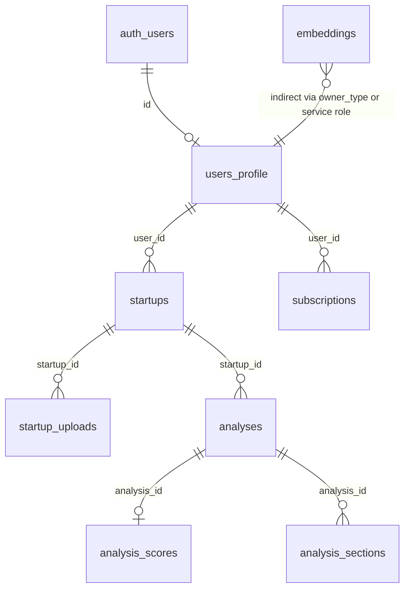

# StressTested — engineering checkpoint

**Generated:** 2026-04-09 06:57:00 CDT (2026-04-09 11:57:00 UTC)

This document is a **handoff map** for coding agents: how the Next.js app is wired, where business logic lives, and how data moves between Supabase, Stripe, OpenAI, and the UI. Update this file when you change architecture or contracts.

---

## 1. Product intent (one paragraph)

**StressTested** is a SaaS that runs **adversarial** startup analyses (not a chat app). Users create **startups** (intake), trigger **analyses** in three **run modes** (`quick_roast`, `committee`, `deep`), and view **structured reports** (verdict, scorecard, sections). **Free vs Pro** is enforced server-side via `users_profile` and Stripe; **public share links** expose only report data via `share_token`.

---

## 2. Tech stack (authoritative)

| Layer | Choice |
|--------|--------|
| Framework | Next.js 14 App Router, TypeScript strict |
| UI | Tailwind CSS, shadcn-style primitives under `components/ui/` |
| Backend | Route handlers `app/api/**/route.ts`, Server Actions `app/actions/**` |
| DB / Auth / Storage | Supabase (Postgres + Auth + Storage) |
| Vector | `pgvector` extension + `embeddings` table (optional pipeline writes not implemented) |
| LLM | OpenAI via `openai` SDK — **JSON chat completions** in `lib/openai/client.ts` (not a separate “Responses API” SDK surface; outputs are JSON-validated with Zod + one repair pass) |
| Payments | Stripe Checkout + webhooks |
| Product analytics | PostHog (client init in `lib/analytics/posthog-client.ts`) |
| Errors | `lib/errors/sentry.ts` stub (logs when `SENTRY_DSN` set) |

---

## 3. Repository layout (mental model)

```
app/
  layout.tsx                 # Root HTML, fonts, Providers (PostHog init)
  globals.css                # CSS variables (dark theme default)
  (marketing)/               # Route group — public marketing (/, /pricing, /demo)
  (app)/                     # Route group — authenticated app shell (/dashboard, /startups, …)
  api/                       # HTTP API: analyze, uploads, share, stripe/*
  auth/callback/route.ts     # OAuth/magic-link code exchange (also used by signup redirect URL)
  login/, signup/            # Email/password auth (client + Supabase)
  share/[token]/             # Public shared report (no app layout auth; uses service role server-side)
components/
  ui/                        # Primitives (button, card, …)
  providers.tsx              # Client: PostHog init on mount
  billing/, startup/, reports/, comparison/
lib/
  env.ts                     # Zod server env; dev placeholders when NODE_ENV !== production
  env-public.ts              # Client-safe public env (Supabase URL/anon, PostHog public keys)
  supabase/server.ts         # Server client (cookie session) — RLS as logged-in user
  supabase/client.ts         # Browser client
  supabase/admin.ts          # Service role — bypasses RLS (pipelines, webhooks, public share fetch)
  analysis/pipeline.ts       # **Main orchestration**: runAnalysisJob(analysisId)
  analysis/persist.ts        # Writes scores + sections + analysis row completion
  openai/client.ts           # completeJson(schema) + repair
  prompts/*.ts               # Prompt builders (strings) for each stage
  scoring/rubric.ts          # Clamp scores, band labels, weighted overall
  scoring/weights.ts         # DEFAULT_SCORE_WEIGHTS
  usage/limits.ts            # canRunAnalysis, canUpload, canCompare
  usage/increment.ts         # Monthly credit usage after successful run
  stripe/client.ts           # Lazy Stripe SDK singleton
  uploads/extract.ts         # pdf-parse + text sanitize
  analytics/events.ts        # Event name constants
  analytics/server.ts        # Server-side capture (currently console in dev)
  validators/output.ts       # Zod for normalize/contradictions/assumptions + re-exports
types/                       # Domain + DB-oriented types
supabase/migrations/         # SQL migrations (run in Supabase project)
scripts/seed.ts              # Optional seed (requires SEED_USER_ID)
tests/                       # Vitest unit/orchestration tests
CONTRACTS.md                 # Frozen API + enums (change with care)
README.md                    # Setup, env, Stripe CLI
```

---

## 4. Environment variables

### 4.1 Server (`lib/env.ts` — `getServerEnv()`)

Validated with Zod. **Production:** all required keys must be real. **Development:** if validation fails, `devPlaceholder()` supplies dummy values so local `next dev` can boot (still replace with real keys for real API calls).

| Variable | Role |
|----------|------|
| `NEXT_PUBLIC_SUPABASE_URL` | Supabase project URL |
| `NEXT_PUBLIC_SUPABASE_ANON_KEY` | Public anon key (browser + server user client) |
| `SUPABASE_SERVICE_ROLE_KEY` | **Secret** — pipeline, webhooks, share page, uploads DB rows |
| `OPENAI_API_KEY` | LLM calls |
| `STRIPE_SECRET_KEY` | Stripe API |
| `STRIPE_WEBHOOK_SECRET` | Verify `/api/stripe/webhook` signatures |
| `NEXT_PUBLIC_STRIPE_PUBLISHABLE_KEY` | Client if you add Elements later |
| `NEXT_PUBLIC_SITE_URL` | Absolute site URL (checkout success/cancel, share URLs) |
| `STRIPE_PRICE_PRO` | **Optional in schema** — recurring Price id for Pro checkout (required for real upgrades) |
| `POSTHOG_KEY`, `POSTHOG_HOST` | Optional server-side (schema); client uses public vars below |
| `SENTRY_DSN` | Optional |

### 4.2 Client (`lib/env-public.ts`)

Uses `NEXT_PUBLIC_*` only. PostHog: `NEXT_PUBLIC_POSTHOG_KEY` / `NEXT_PUBLIC_POSTHOG_HOST` **or** falls back to `POSTHOG_KEY` / `POSTHOG_HOST` for host.

**Rule:** Never import `lib/env.ts` (`getServerEnv`) from client components — use `lib/env-public.ts`.

---

## 5. Database (Supabase Postgres)

### 5.1 Migrations

- `supabase/migrations/20250409000000_init.sql` — extensions (`pgcrypto`, `vector`), tables, indexes, RLS.
- `supabase/migrations/20250409000001_auth_profile.sql` — `on_auth_user_created` trigger on `auth.users` → inserts `public.users_profile`.

Apply these in the Supabase SQL editor or CLI against the linked project.

### 5.2 Tables (logical relationships)



- **`users_profile`:** `plan_tier` (`free` | `pro`), `monthly_credit_limit`, `monthly_credit_used`, `stripe_customer_id`.
- **`startups`:** Full intake fields; `competitors` is `text[]`.
- **`startup_uploads`:** Storage path + `extracted_text` (fed into normalization in the pipeline).
- **`analyses`:** `run_type`, `tone`, `status`, `input_snapshot` (JSON), `canonical_brief`, `verdict`, `summary`, `confidence_score`, `share_token` (unique, nullable).
- **`analysis_scores`:** One row per analysis (dimensions + `overall_score`).
- **`analysis_sections`:** Multiple rows per analysis; `section_type` + `content` jsonb.
- **`subscriptions`:** Stripe subscription mirror; `stripe_subscription_id` unique.
- **`embeddings`:** `vector(1536)` — **no code path currently writes here** (reserved for future retrieval).

### 5.3 RLS (high level)

- Users see/modify only rows tied to their `user_id` through `startups` / `subscriptions`.
- **Public read** policies allow `SELECT` on `analyses` (and related scores/sections) when `share_token IS NOT NULL` so shared links work with anon/authenticated clients. The app’s **public share page** instead uses **service role** in `app/share/[token]/page.tsx` to avoid leaking unrelated data in complex joins — keep that pattern if you change RLS.
- **Service role** bypasses RLS for pipeline writes (`lib/supabase/admin.ts`).

---

## 6. Authentication and session

| Concern | Implementation |
|---------|------------------|
| Sign up / sign in | `app/signup/page.tsx`, `app/login/page.tsx` use `createSupabaseBrowserClient()` (`lib/supabase/client.ts`) |
| Session refresh | `@supabase/ssr` cookie adapter in `lib/supabase/server.ts` |
| OAuth / email link callback | `GET /auth/callback` — `exchangeCodeForSession` in `app/auth/callback/route.ts` |
| Protected UI routes | `middleware.ts` redirects unauthenticated users to `/login?next=…` for prefixes: `/dashboard`, `/startups`, `/analyses`, `/compare`, `/settings` |
| Sign out | Server Action `app/actions/auth.ts` → `signOut()` |

**Profile row:** Created by DB trigger on `auth.users` insert. App code does not manually insert `users_profile` on signup (except optional `scripts/seed.ts` upsert).

---

## 7. HTTP API — request flows

### 7.1 `POST /api/analyze` (`app/api/analyze/route.ts`)

**Public contract:** See `CONTRACTS.md`.

**Flow:**

1. Parse body with Zod: `startupId`, `runType`, `tone`.
2. `createSupabaseServerClient()` → `auth.getUser()`.
3. Load `users_profile` → `canRunAnalysis()` (`lib/usage/limits.ts`).
4. Verify startup ownership: `startups` where `id = startupId` and `user_id = user.id`.
5. Build `input_snapshot` from startup columns.
6. `createSupabaseAdminClient()` inserts `analyses` row: `status: queued`, `input_snapshot`.
7. `captureServerEvent(ANALYTICS.analysis_started)` (stub logs in dev).
8. **`await runAnalysisJob(analysis.id)`** — synchronous long request (`export const maxDuration = 300`).
9. On success: `analysis_completed` event; return `{ analysisId }`.
10. On thrown error: pipeline marks analysis failed inside `runAnalysisJob` / persist helpers; API returns 500.

**Critical:** Usage increments happen **after successful persist** inside `lib/usage/increment.ts` (called from `runAnalysisJob`).

### 7.2 `POST /api/uploads` (`app/api/uploads/route.ts`)

1. Auth user; `canUpload(plan)` → Pro only.
2. Verify startup ownership.
3. `multipart/form-data`: `file`, `startupId`.
4. Allowed MIME: pdf, plain, markdown (see file).
5. `createSupabaseAdminClient().storage.from('uploads').upload(...)` — **bucket must exist** (see README).
6. `extractTextFromBuffer` → insert `startup_uploads` with `extracted_text`.

### 7.3 `POST /api/share` (`app/api/share/route.ts`)

1. Auth user; load analysis; verify startup owner.
2. If `share_token` null, generate token (`lib/utils.randomToken`) and update analysis via admin client.
3. Return `{ token, shareUrl }` using `NEXT_PUBLIC_SITE_URL` from `lib/env-public.ts`.

### 7.4 `POST /api/stripe/checkout` (`app/api/stripe/checkout/route.ts`)

1. Auth required; uses `STRIPE_PRICE_PRO` from `getServerEnv()`.
2. Creates Checkout Session with `client_reference_id` / `metadata.supabase_user_id` = user id.
3. Returns `{ url }` for redirect.

### 7.5 `POST /api/stripe/webhook` (`app/api/stripe/webhook/route.ts`)

1. Raw body + `stripe-signature` verified with `STRIPE_WEBHOOK_SECRET`.
2. Handles `checkout.session.completed`, `customer.subscription.*` to upsert `subscriptions` and set `users_profile.plan_tier`, `monthly_credit_limit` (20 for pro, 3 for free on downgrade), `stripe_customer_id`, reset usage where appropriate.

---

## 8. Analysis pipeline (core domain)

**Entry point:** `runAnalysisJob(analysisId: string)` in `lib/analysis/pipeline.ts`.

**Supabase access:** Always **`createSupabaseAdminClient()`** for reads/writes in the pipeline so jobs are not blocked by RLS timing issues during server-side execution.

### 8.1 Data loaded

- `analyses` row (includes `run_type`, `tone`, `startup_id`).
- `startups` row (full snapshot).
- All `startup_uploads.extracted_text` concatenated for normalization context.

### 8.2 Stages (by `run_type`)

| Mode | Stages |
|------|--------|
| `quick_roast` | (1) Normalize brief → `normalizeOutputSchema` (2) Single `buildQuickRoastPrompt` → `finalAnalysisSchema` (3) `persistCompletedAnalysis` with **empty `committee`** array |
| `committee` | Normalize → **6 parallel** `completeJson` calls (`vc_partner`, `customer_skeptic`, `growth_lead`, `product_strategist`, `technical_reviewer`, `competitor_analyst`) → contradictions → assumptions (`committee` depth) → synthesis → persist |
| `deep` | Same as committee until assumptions prompt uses `depth: "deep"` in `buildAssumptionsPrompt` → synthesis → persist |

**LLM helper:** `completeJson` in `lib/openai/client.ts`:

- Calls `chat.completions.create` with `response_format: { type: "json_object" }`.
- Parses JSON, validates with Zod; on failure, **one repair** completion.
- Throws if still invalid (analysis should end in failed state via `markAnalysisFailed`).

### 8.3 Prompts

Each file under `lib/prompts/` exports a `build*Prompt(...)` returning a string. Shared suffix: `lib/prompts/shared.ts` (`jsonOnlyFooter`).

### 8.4 Persistence (`lib/analysis/persist.ts`)

- Updates `analyses`: `status: completed`, `canonical_brief`, `verdict`, `summary`, `confidence_score`, `completed_at`.
- Replaces `analysis_scores` (delete + insert) with **rubric-adjusted** dimensions from `applyScoreRubric` + `weightedOverall` (`lib/scoring/rubric.ts`).
- Replaces `analysis_sections` rows for: `kill_reasons`, `survive_reasons`, `contradiction_report`, `assumptions`, `experiments`, `repositioning`, `committee_outputs`, `ui_quotes`, `scoring_rationale` (stores `{ tone, runType }`).

**Failure:** `markAnalysisFailed` sets `status: failed`, writes short message into `summary` field (truncated).

### 8.5 Usage accounting (`lib/usage/increment.ts`)

After successful persist:

- **Free:** increment `monthly_credit_used` only for `quick_roast`.
- **Pro:** increment for `committee` and `deep` only; **unlimited** quick roasts (no increment).

Aligns with `canRunAnalysis` in `lib/usage/limits.ts`.

---

## 9. Scoring

- Model outputs **dimension scores** inside `finalAnalysisSchema` (`types/llm.ts`).
- **Displayed** scores are passed through `applyScoreRubric` (clamp 1–10) and `weightedOverall` using `DEFAULT_SCORE_WEIGHTS` (`lib/scoring/weights.ts`).
- Band copy for labels: `SCORE_RUBRICS` in `lib/scoring/rubric.ts` (optional use in UI — report currently shows numeric + progress bars).

---

## 10. Frontend routes (user journeys)

| Path | File | Notes |
|------|------|------|
| `/` | `app/(marketing)/page.tsx` | Landing |
| `/pricing` | `app/(marketing)/pricing/page.tsx` | Uses `CheckoutButton` |
| `/demo` | `app/(marketing)/demo/page.tsx` | Static mock report |
| `/login`, `/signup` | `app/login/page.tsx`, `app/signup/page.tsx` | Email/password |
| `/dashboard` | `app/(app)/dashboard/page.tsx` | Lists startups + recent analyses |
| `/startups/new` | `app/(app)/startups/new/page.tsx` | Form → `createStartup` server action |
| `/startups/[id]` | `app/(app)/startups/[startupId]/page.tsx` | Detail, uploads, history |
| `/startups/[id]/analyze` | `app/(app)/startups/[startupId]/analyze/page.tsx` | `RunAnalysisClient` → `POST /api/analyze` |
| `/analyses/[id]` | `app/(app)/analyses/[analysisId]/page.tsx` | Loads scores + sections → `AnalysisReport` |
| `/compare/[startupId]` | `app/(app)/compare/[startupId]/page.tsx` | Pro gate; `ComparePicker` sets `?left=&right=` |
| `/settings` | `app/(app)/settings/page.tsx` | Plan + `CheckoutButton` |
| `/share/[token]` | `app/share/[token]/page.tsx` | **Public** report; admin client; no PII |

**App shell:** `app/(app)/layout.tsx` — nav + `signOut` form.

---

## 11. Types and validation

- **Domain types:** `types/startup.ts`, `types/analysis.ts`, `types/llm.ts`, `types/db.ts`.
- **API / LLM parsing:** Zod schemas in `types/llm.ts` + `lib/validators/output.ts` (normalize, contradictions, assumptions).
- **Single source for committee evaluator shape:** `committeeOutputSchema` in `types/llm.ts`.

---

## 12. Testing

- **Runner:** Vitest (`vitest.config.ts`), alias `@/*` → repo root.
- **Tests:** `tests/rubric.test.ts`, `tests/validators.test.ts`, `tests/orchestration.test.ts` (mocks admin client), `tests/webhook.test.ts` (placeholder).
- **Commands:** `npm test`, `npm run build`, `npm run lint`.

---

## 13. Scripts and ops

- **`scripts/seed.ts`:** Upserts profile and inserts demo startups/analyses for an **existing** `auth.users` id (`SEED_USER_ID`). Run with service role env vars.
- **Storage:** Create bucket `uploads` (private); path pattern `{startupId}/{token}.{ext}`.
- **Stripe CLI:** Forward webhooks to `/api/stripe/webhook` (see README).

---

## 14. Extension points (where to iterate safely)

| Goal | Where to work |
|------|----------------|
| New run mode or pipeline stage | `lib/analysis/pipeline.ts`, new prompt file, extend `RunType` in `types/analysis.ts` + migration if needed |
| Stricter outputs | Zod in `types/llm.ts` / `lib/validators/output.ts` |
| Embeddings / retrieval | `embeddings` table + optional calls after persist in pipeline; consider batching OpenAI embeddings |
| Async jobs (queue) | Replace synchronous `await runAnalysisJob` in `/api/analyze` with queue worker; keep `runAnalysisJob` as worker entry |
| True Sentry / PostHog server | Replace stubs in `lib/errors/sentry.ts`, `lib/analytics/server.ts` |
| PDF export | `AnalysisReport` currently has disabled **Export PDF** placeholder button |
| RLS tightening | Review policies for `share_token` select exposure; align with product threat model |

---

## 15. Known implementation notes

- **Orchestration naming:** Build spec mentions `runQuickRoast` / `runCommitteeAnalysis` / `runDeepStressTest`; the codebase uses a **single** `runAnalysisJob(analysisId)` that branches on `analyses.run_type` (already stored at creation time).
- **OpenAI:** Uses Chat Completions JSON mode, not a separate SDK class named “Responses API”.
- **Monthly credits:** Single counter `monthly_credit_used` with semantics that depend on plan + run type (see §8.5). Pro committee/deep cap uses `monthly_credit_limit` (20 after Stripe webhook).
- **Git:** Repository may or may not be git-initialized; checkpoint is independent of VCS.

---

## 16. Quick reference — “where do I change X?”

| X | Primary location |
|---|------------------|
| Marketing copy | `app/(marketing)/**` |
| Report layout | `components/reports/analysis-report.tsx`, `app/share/[token]/page.tsx` |
| Plan limits | `lib/usage/limits.ts`, `lib/usage/increment.ts`, Stripe webhook |
| LLM model name | `lib/openai/client.ts` (`model` default `gpt-4o-mini`) |
| DB schema | `supabase/migrations/*.sql` + update `CONTRACTS.md` |
| Public API shapes | `CONTRACTS.md` + `app/api/**` |

---

*End of checkpoint — keep this file accurate when merging architectural changes.*
